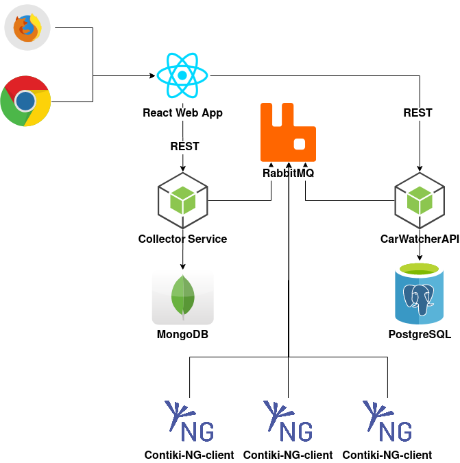

# CarWatcher kubernetes deployment
CarWatcher kubernetes is a microservice backend application of CarWatcher APP deployed using kubernetes.

## App architecture 
- Contiki-NG clients read value from car sensors and publish data to RabbitMQ
- Collector Service collects published sensor data, store it in MongoDB and exposes REST API service for access to this data
- CarWatcher API contains business logic for CarWatcher app and exposes REST API service
- Collector Service and CarWatcher API synchronize about Contiki-NG client status through RabbitMQ
- React Web App  

## App setup
Download minikube and create a new cluster with `minikube start`.  
Deploy all yaml files from kubernetes folder and kubernetes will download and start app images from Docker Hub (`kubectl apply -f ./kubernetes`).
Wait untill all pods are running and start test React app from web_client folder.  
React application in web_client folder is purely for testing the functionalites of deployed cluster.